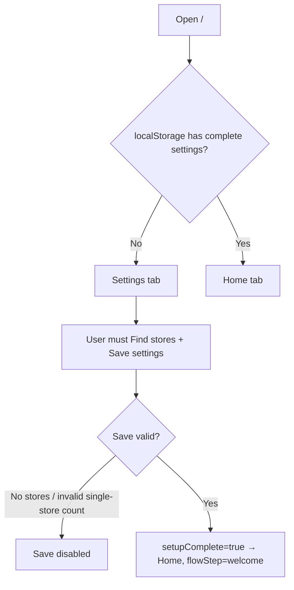
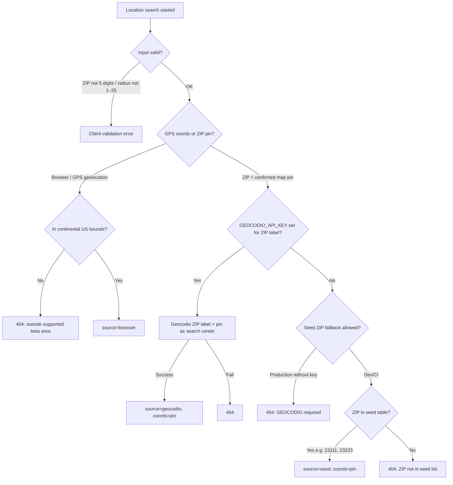
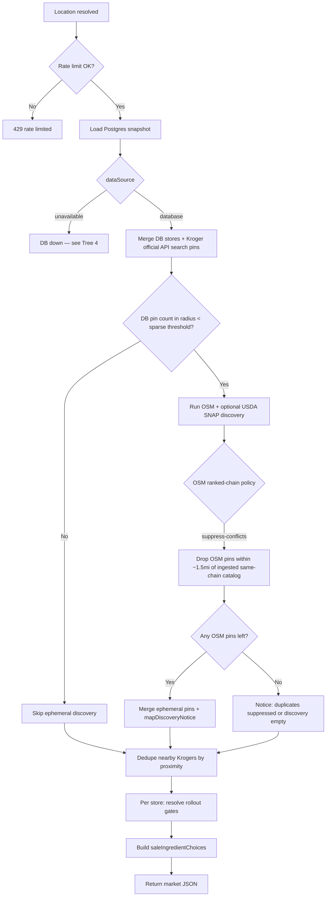
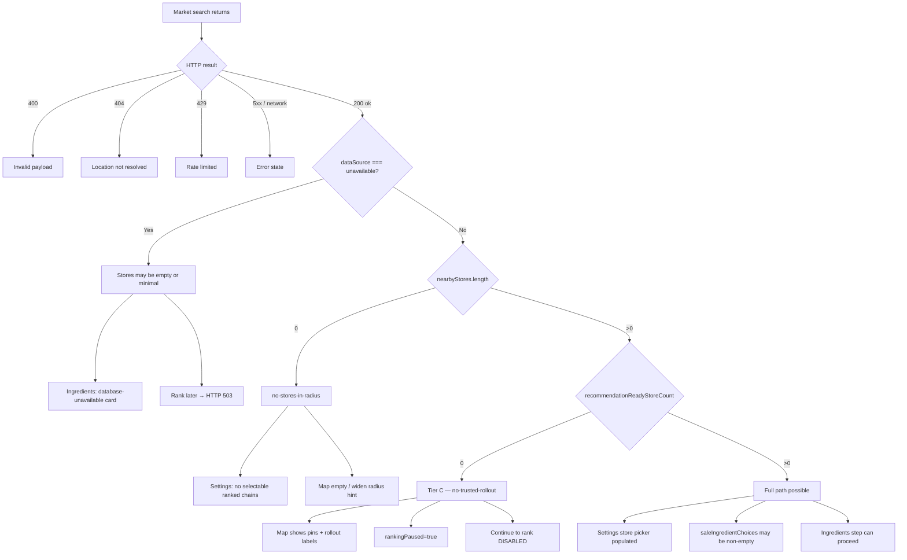
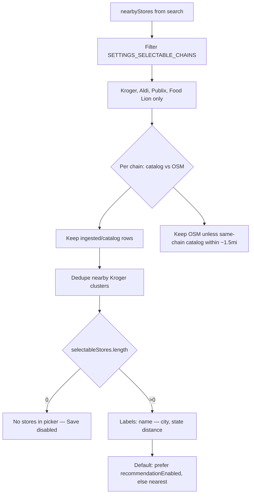
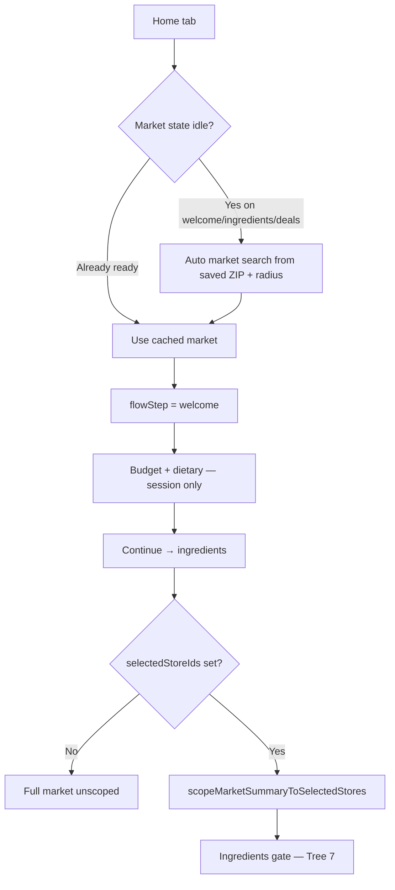
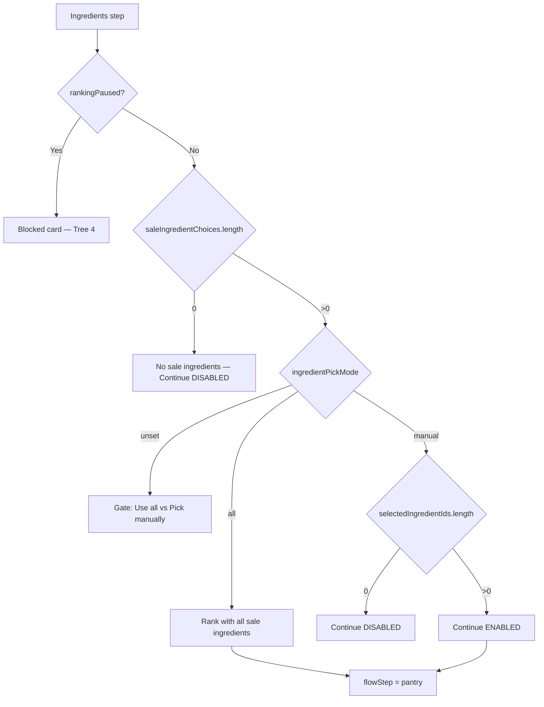
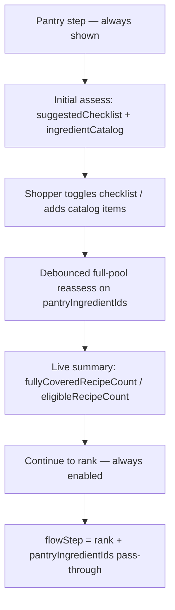
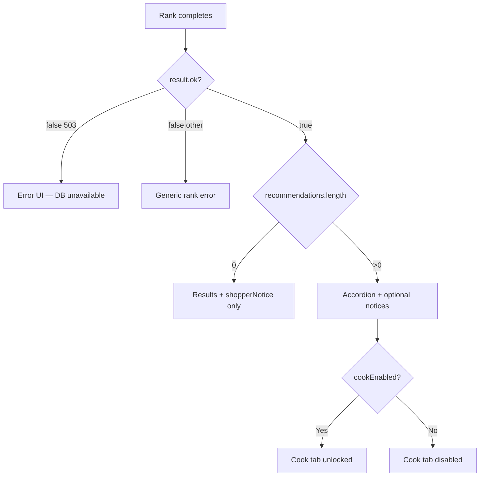

# Yum4Less application decision trees

Reference document derived from the beta v1 codebase (client shell, `use-meal-planner`, `/api/market-search`, `/api/recommendations`, rollout gates, and fallbacks). Use this when debugging “why did the app do X?” or onboarding someone to the product flow.

**Related:** [`README.md`](../README.md) · [`PROJECT_CONTINUITY.md`](../PROJECT_CONTINUITY.md) · [`AGENTS.md`](../AGENTS.md)

---

## How to read these trees

Each decision point branches based on what the code checks next. Follow arrows top-to-bottom. Mermaid diagrams render in GitHub, many IDEs, and VS Code/Cursor markdown preview.

**Legend**

| Symbol | Meaning |
|--------|---------|
| ◇ | Decision / branch |
| Tier C | Map/context works; ranked meal estimates do not (normal in many ZIPs) |
| `recommendationEnabled` | Per-store flag after weekly-ad or Kroger API promotion gates |

---

## Tree 1 — App launch and tab routing



### `isSettingsPreferencesComplete()` requires

- `setupComplete === true` (set only on explicit **Save settings**)
- Valid ZIP and radius
- `shoppingStyle` set
- At least one `selectedStoreId`
- Single-store mode: exactly one store

**Note:** ZIP, radius, stores, and theme auto-save to `localStorage` on change, but `setupComplete` stays false until Save — first-time users remain on Settings until they click Save.

**Key files:** `src/lib/settings-preferences.ts`, `src/components/meal-planner/app-tab.ts`

---

## Tree 2 — Location resolution (GPS / ZIP Find stores)

Settings CTAs (left → right): **For Better Results, Use My GPS Location** · **Find stores based on my ZIP** (ZIP path opens a map center-pin confirm before market-search).



**Practical implication:** Local dev without Geocodio only resolves **seed ZIPs** unless `GEOCODIO_API_KEY` is set. GPS bypasses ZIP geocoding but must be inside continental US bounds. ZIP Find uses a shopper-picked pin (cached in `yum4less.zip-search-centers.v1`) as the radius center.

**Key files:** `src/lib/location-resolution.ts`, `src/lib/geocoding.ts`, `src/lib/zip-search-centers.ts`, `src/components/meal-planner/zip-search-center-picker-overlay.tsx`

---

## Tree 3 — Market search (`POST /api/market-search`)



### Per-store rollout at search time

| Chain | `recommendationEnabled: true`? | How |
|-------|--------------------------------|-----|
| Kroger-family | Yes | Weekly-ad gates pass **or** Kroger official API gates pass |
| Aldi, Publix, Food Lion | Yes | Weekly-ad promotion gates pass |
| Walmart | **Never** | Hard-blocked for ranked pricing |
| BJ's, unknown, etc. | **Never** | Context / coming-soon only |

### Weekly-ad promotion gates pass when (per store)

- Chain in ranked weekly-ad set (not Walmart for ranking)
- `usesWeeklyAdSource` and `matchedIngredientCount > 0`
- ≥ `MIN_WEEKLY_AD_PROMOTION_MATCHES` (3) matched ingredients
- Average match confidence ≥ `MIN_WEEKLY_AD_PROMOTION_CONFIDENCE` (0.45)
- Max freshness < `WEEKLY_AD_PROMOTION_FRESHNESS_HOURS` (24, same as `RANKED_PRICE_CACHE_TTL_HOURS`)
- `coverageStatus !== "none"`

**Key files:** `src/app/api/market-search/route.ts`, `src/lib/market-search-service.ts`, `src/lib/provider-rollout.ts`, `src/lib/weekly-ad-ingestion/weekly-ad-coverage.ts`

---

## Tree 4 — After market search (client outcomes)



**Client `marketBlocked`** = scoped market exists **and** `recommendationReadyStoreCount === 0`.

**Key files:** `src/lib/market-shopper-status.ts`, `src/components/meal-planner/use-meal-planner.ts`

---

## Tree 5 — Settings store picker



**On map but not in Settings picker:** Walmart, BJ's, most non-ranked chains; ranked chains outside radius; OSM pins suppressed as catalog duplicates.

**Key files:** `src/lib/settings-store-selection.ts`, `src/components/meal-planner/settings-panel.tsx`, `src/lib/store-display-labels.ts`

---

## Tree 6 — Home flow



**Key files:** `src/components/meal-planner/index.tsx`, `src/components/meal-planner/use-meal-planner.ts`, `src/lib/store-scope.ts`

---

## Tree 7 — Ingredients step



**Key files:** `src/components/meal-planner/ingredients-step-panel.tsx`

---

## Tree 7b — Pantry check step (`POST /api/pantry-coverage`)



| Rule | Behavior |
|------|----------|
| Near-miss checklist | Distinct missing ingredients from recipes missing 1–4 plan lines (empty OK) |
| Open-ended add | Catalog autocomplete only — no free-text IDs |
| Totals | Pantry lines excluded from `estimatedTotal`; visible on results with trust copy |
| Session | `pantryIngredientIds` not persisted |

**Key files:** `src/components/meal-planner/pantry-step-panel.tsx`, `src/app/api/pantry-coverage/route.ts`, `src/lib/recipe-plan-coverage.ts`

---

## Tree 8 — Rank (`POST /api/recommendations`)

```mermaid
flowchart TD
  A[Suggest recipes clicked] --> B{Request valid?}
  B -->|400| X1[Bad payload / invalid market snapshot]
  B -->|404| X2[Location resolution failed]
  B -->|429| X3[Rate limited]

  B -->|OK| C{Market pass-through valid?}
  C -->|ZIP/radius/coords mismatch| D[409 — search again]
  C -->|stale recommendationReadyStoreCount| D
  C -->|OK| E[Rehydrate stores from DB snapshot]

  E --> F{dataSource unavailable?}
  F -->|Yes| G[503 RecommendationDependencyUnavailableError]
  F -->|No| H[Scope to selectedStoreIds]

  H --> I{Any recommendationEnabled stores selected?}
  I -->|No| J[ok:true, recs:[], notice: No ranked stores]
  I -->|Yes| K{Effective sale ingredients?}

  K -->|No| L[ok:true, recs:[], notice: No sale ingredients]
  K -->|Yes| M[Filter recipes: source, coverage, diet, budget, ingredients]

  M --> N{candidates.length}
  N -->|0| O[ok:true, recs:[], notice: No recipe ideas]
  N -->|>0| P[ok:true, sorted meals + trust labels]

  M --> M1{pantryIngredientIds?}
  M1 -->|Yes| M2[Plan builder emits sourcedFromPantry rows — excluded from total]
  M1 -->|No| M
  M2 --> N
```

| HTTP / response | Meaning |
|-----------------|--------|
| **503** | Infrastructure / DB unavailable |
| **409** | Stale market snapshot — re-run Find stores |
| **ok:true + empty + notice** | Honest empty rank (coverage, filters, Tier C) |

**Key files:** `src/app/api/recommendations/route.ts`, `src/lib/recommendation-service.ts`, `src/lib/market-pass-through.ts`

---

## Tree 9 — Per-meal candidate filtering

A recipe becomes a ranked candidate only if **all** pass:

1. In ranking pool (internal recipe library by default)
2. Sale-priced ingredients overlap recipe needs
3. Matches manual `selectedIngredientIds` (if manual mode)
4. Matches dietary focus (vegetarian / vegan / quick)
5. `estimatedTotal ≤ budget`
6. Shopping plan ingredient count ≤ `maxIngredients`
7. Single-store or multi-store plan builds successfully
8. `scoreCandidate` returns a valid plan

Failure at any step drops the recipe. If all drop → empty results with shopper notice.

**Key files:** `src/lib/recommendation-service.ts`, `src/lib/shopping-plan-builder.ts`

---

## Tree 10 — Results and Cook tab



**C1 contract:** `shopperNotice` and non-empty `recommendations` may both render.

**Key files:** `src/components/meal-planner/meal-results-panel.tsx`, `src/components/meal-planner/use-meal-planner.ts`

---

## Tree 11 — “Why don’t I see my grocery store?”

```
Is the chain Kroger-family, Aldi, Publix, or Food Lion?
├─ NO  → Expected. Map may show context; Settings picker excludes it.
└─ YES → Within radius after Find stores?
    ├─ NO  → Widen radius or change ZIP / geolocation.
    └─ YES → In Postgres ingest for this area?
        ├─ NO  → OSM may add pin if sparse threshold triggers.
        │         └─ May be suppressed if ingested same-chain store within ~1.5mi.
        └─ YES → Filtered by OSM/catalog or Kroger dedupe?
            ├─ YES → Another pin for same cluster won.
            └─ NO  → Should appear in picker (name — city, state, distance).
```

---

## Tree 12 — Symptom → cause → action

| What you see | Likely branch | What to try |
|--------------|---------------|-------------|
| Stuck on Settings | `setupComplete` false | Find stores → pick store(s) → **Save settings** |
| “Enter valid ZIP” | Location validation | 5-digit continental US ZIP |
| Location 404 | Seed / Geocodio miss | `GEOCODIO_API_KEY`, seed ZIP (23111), or geolocation |
| Store picker empty | No selectable ranked chains in radius | Larger radius, different ZIP, ingest |
| Map has Walmart, Settings doesn’t | Not in `SETTINGS_SELECTABLE_CHAINS` | Pick ranked chain for meal estimates |
| “Map ready — meal estimates not available” | Tier C: `recommendationReadyStoreCount === 0` | Ingest refresh; check rollout labels on map |
| “Store and meal prices aren’t loading” | `dataSource === "unavailable"` | `npm run db:up`, fixture ingest |
| No sale ingredients | Empty `saleIngredientChoices` | Different store, ingest, widen scope |
| Continue to rank greyed out | `rankingPaused` or no ingredients | Fix Tier C or pick ingredients |
| Rank 409 | Stale market pass-through | **Find stores** after location change |
| Rank 503 | DB unavailable at rank time | Fix Postgres connection |
| Rank ok, 0 meals | Filter / coverage path | Budget, ingredients, dietary |
| Cook tab disabled | `cookEnabled` false | Successful rank with ≥1 meal |

---

## End-to-end paths (summary)

### Happy path

Settings complete → `dataSource=database` + `recommendationReadyStoreCount > 0` → sale ingredients exist → rank returns meals → Cook unlocks.

### Normal beta path (Tier C)

Settings complete → stores on map → **no store passes promotion gates** → ingredients blocked → map/context still useful, no dinner estimates.

### Broken dev path

Postgres down → market empty or blocked → rank **503** → fix DB + ingest before product debugging.

---

## Technical pipeline (reference)

```
Browser (useMealPlanner)
  ├─ localStorage — yum4less.settings-preferences.v1
  ├─ POST /api/market-search
  │     ├─ resolveLocationInput
  │     └─ getMarketSearchExperience → Postgres + provider + optional OSM
  └─ POST /api/recommendations
        ├─ validatePassedMarketForRanking (409 if stale)
        └─ getRecommendationExperience → scope stores → filter recipes → score
```

Public HTTP routes are read-only by default (`YUM4LESS_ENABLE_API_DB_WRITES` required for API writes).

---

*Generated from codebase review, June 2026. Update this doc when flow or gating logic changes materially.*
