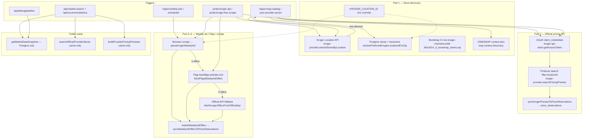

# Kroger data path audit (2026-06-26)

Read-only code trace across store discovery, official API pricing, Flipp, scraping, other paths, and test inventory. **No code changes applied in this pass.**

**Authority:** `PROJECT_CONTINUITY.md` for product/UX decisions. Trust copy → `.cursor/rules/yum4less-product-and-trust.mdc`.

**Reusable pattern (store-agnostic):** [`docs/provider-integration-pattern.md`](../provider-integration-pattern.md) — three data-type categories, capability matrix, and new-chain checklist derived from this audit.

**Not verified this session:** `npm test`, Postgres MCP, Playwright MCP, `probe:kroger-api`, `probe:kroger-live-scrape`, live Flipp/Kroger network calls, or owner baseline numbers in `PROJECT_CONTINUITY.md` (122/4). Claims below cite source locations only unless a named test file is listed.

---

## Master flow diagram

---

## Master table — every Kroger path

| # | Path | Trigger | Live vs cache | Precedence / fallback | Writes `stores` | Writes `price_observations` | Test coverage |
|---|------|---------|---------------|----------------------|-----------------|---------------------------|---------------|
| **1a** | Kroger Location API discovery | `ingest:map-catalog`, `sync:provider-prices` (`readMode: "live-allowed"`) | **Live** on ingest; **cache-only** on public search | On API error → cached snapshot if any, else empty fallback message (`provider-market-service.ts`) | Upsert `kroger-{locationId}` via `syncV1ChainStoresToCatalog` | No | `kroger-provider.test.ts`, `provider-market-service.test.ts`, `kroger-api-client.test.ts` |
| **1b** | Public store-discovery read | `/api/market-search`, recommendations market pass-through | **Cache-only** (default `readMode`) | Cache miss → `fallback-local`, empty stores, no live call | No (optional snapshot persist only if `YUM4LESS_ENABLE_API_DB_WRITES=1` in non-production) | No | `market-search/route.test.ts`, `provider-market-service.test.ts` |
| **1c** | `resolvePreferredKrogerLocationIdForZip` | `sync:provider-prices` only | Postgres read + haversine | 1) Nearest Kroger-family row with numeric `source_store_id` + coords → 2) env `KROGER_LOCATION_ID` if no candidates / no coords / DB error | No | No | `kroger-preferred-location.test.ts` |
| **1d** | `resolveKrogerStoreForWeeklyAd` | Weekly-ad ingest, probes | Live Location API if configured | 1) `KROGER_LOCATION_ID` (any trimmed string) → 2) catalog `source_store_id` for `storeId` → 3) `resolveLocationIdForZip` | No | No | `kroger-weekly-ad-store.test.ts` |
| **1e** | Bootstrap seed | CI/E2E only (`YUM4LESS_CI_BOOTSTRAP_STORES=1`) | Static SQL | Slug id `kroger-mechanicsville`, `source_store_id=kroger-mechanicsville` (not numeric locationId) | Seed insert | No | `market-repository.integration.test.ts`, route tests use fixture |
| **1f** | OSM/SNAP map context | Search-time if sparse pins; `ingest:map-catalog` for OSM upsert | Live Overpass on ingest/search | Map merge priority: **`kroger-official-api`=5** > other ranked=4 > weekly-ad=3 > context=1 (`market-store-catalog-merge.ts`) | OSM upsert with `preserveRankedSources: true` | No | `map-osm-ranked-chain-policy.test.ts`, `market-store-catalog-merge.test.ts` |
| **1g** | Coordinate reconciliation | After map-catalog / provider sync | Uses API + Geocodio + SNAP witnesses | **`kroger-official-api` witness preferred**; multi-witness agreement required to move API-verified pins (`store-location-reconciliation.ts`) | Updates lat/lon, `source_name`, `source_store_id` on eligible rows | No | `store-location-reconciliation.test.ts`, `store-catalog-sync.test.ts` |
| **1h** | `resolveInternalKrogerStoreId` | Official price sync | N/A (mapping only) | 1) `source_store_id` match (bootstrap slug preferred if non-API id) → 2) `kroger-{locationId}` → 3) id substring → 4) strong name heuristic (single match only) | No | No | `provider-price-observation-sync.test.ts` |
| **2a** | OAuth token | Any live Kroger API call | In-memory cache per `clientId:scope`, 60s expiry buffer, in-flight dedup; **no refresh token** — re-fetch on expiry | Missing creds → not-configured / probe failure | No | No | `kroger-api-client.test.ts` |
| **2b** | Product pricing preview | `sync:provider-prices` (`live-allowed`) | **Live** on ingest; **cache-only** on public reads | Certification / non-production → items stripped (`isKrogerOfficialOnlinePricingEligible`); API error → cached snapshot or fallback | Optional preview snapshot if dev DB-write flag | No | `kroger-provider.test.ts`, `provider-pricing-preview-service.test.ts` |
| **2c** | `syncKrogerPreviewToPriceObservations` | `sync:provider-prices` | Live preview input | `skip_reason`: `not-production`, `store-mapping-failed`, `no-preview-items`, `low-confidence`, `wrong-provider` | Touches `stores.last_verified_at` | **Yes** → `price_observations` (`source_name=kroger-official-api`) | `provider-price-observation-sync.test.ts`, `price-observation-writes.test.ts` |
| **2d** | Certification gap | `KROGER_API_ENV` ≠ `production` | Catalog calls may succeed; **store prices omitted** | Sync skipped with `not-production`; weekly-ad rows remain ranked path | No new official rows | No | `kroger-api-types.test.ts`, `kroger-provider.test.ts` |
| **3a** | Flipp syndicated feed | Weekly-ad ingest when scrape returns 0 | Live HTTP to `backflipp.wishabi.com` | Second tier after scrape; labels offers `"Directional — weekly ad syndicated feed"` (`flipp-weekly-ad-feed.ts`) | No | No (raw only) | `flipp-weekly-ad-feed.test.ts`; **no live Kroger+Flipp integration test** |
| **3b** | Ingredient matching | All weekly-ad paths | N/A | `MIN_WEEKLY_AD_MATCH_CONFIDENCE=0.55` + reject guards; unmatched offers get no `ingredientId` | No | No | `weekly-ad-ingredient-matching.test.ts`, `weekly-ad-match-guards` via patterns file |
| **3c** | Weekly-ad → Postgres sync | `ingest:weekly-ads` with `persistToDatabase: true` | Reads matched offers | Only offers **with `ingredientId`** and confidence ≥ 0.55; best-one-per-ingredient; official API tier supersedes weekly-ad on read | `touchStoreVerification` | **Yes** (`kroger-weekly-ad-scrape`) | `weekly-ad-offer-sync.test.ts`, integration test |
| **4a** | Direct Kroger scrape | Weekly-ad ingest (always first) | Browser-first Playwright, HTTP fallback; anti-bot launch args | `YUM4LESS_WEEKLY_AD_NO_BROWSER=1` forces HTTP only | No | No | `kroger-weekly-ad-fetcher.test.ts`, `parse-kroger-weekly-ad.test.ts`; fixture ingest in `weekly-ad-ingestion-service.test.ts` |
| **4b** | Official API weekly-ad fallback | Third tier if scrape + Flipp both empty | Live product search per tracked ingredient | Silent `[]` if no creds, no locationId, or no price in response | No | No | **No dedicated test** for `kroger-weekly-ad-api-fallback.ts` |
| **4c** | Scrape compliance (M128/M151) | N/A | **Manual owner pause only** — no robots.txt, no auto-pause, no `YUM4LESS_DISABLE_INGEST_*` in code | Matches corrected `yum4less-security-and-dependencies.mdc` | — | — | **No compliance automation tests** (not shipped) |
| **5a** | `/api/debug/pipeline` | Debug route | Postgres read-only | Lists Kroger obs by `source_name`; no live Kroger | No | No | `pipeline-debug-service.test.ts`, `route.test.ts` |
| **5b** | Provider search terms | Sync/preview ingredient queries | Postgres `provider_search_terms` | ~101 Kroger terms in `db/init/013_kroger_search_terms_full.sql` | No | No | `provider-search-terms.test.ts`, integration test |
| **5c** | Promotion / trust gates | Ranking UI | Reads cached obs | `kroger-official-api-coverage.ts`: ≥3 fresh official matches / 24h; weekly-ad separate gates | No | No | `kroger-official-api-coverage.test.ts`, `sale-confidence.test.ts` |
| **5d** | TheMealDB import | Post weekly-ad if `THEMEALDB_IMPORT_AFTER_WEEKLY_AD=1` | Indirect | Uses sale observations including Kroger rows | No | No | `recommendation-service-themealdb.test.ts` |
| **5e** | `.private/` | — | **No Kroger references found** | — | — | — | N/A |
| **5f** | Public API Kroger writes | All `/api/*` routes | Read-only for `price_observations` | Even `YUM4LESS_ENABLE_API_DB_WRITES=1` only allows **provider snapshot** cache writes, not price sync (`public-api-db-write-policy.ts`) | Snapshot only (dev) | **No** | `public-api-response-sanitizer.test.ts`, route tests |

---

## Part 1 — Store discovery

### Call sites

| Function | File | When |
|----------|------|------|
| `searchStoresByLocation` | `src/lib/providers/kroger-provider.ts` | Ingest with `live-allowed`; public with `cache-only` |
| `resolveLocationIdForZip` | `src/lib/providers/kroger/kroger-api-client.ts` | Weekly-ad store resolution, probes, API fallback |
| `resolvePreferredKrogerLocationIdForZip` | `src/lib/kroger-preferred-location.ts` | `sync:provider-prices` locationId for product queries |
| `resolveInternalKrogerStoreId` | `src/lib/provider-price-observation-sync.ts` | Mapping preview → internal store for price writes |
| `syncV1ChainStoresToCatalog` | `src/lib/store-catalog-sync.ts` | Upsert/merge Kroger API stores into Postgres |
| `mergeCatalogStoresForMap` | `src/lib/market-store-catalog-merge.ts` | Search-time pin dedupe; API beats OSM |

### Precedence vs `PROJECT_CONTINUITY.md`

- Map merge: `kroger-official-api` priority **5** beats OSM/SNAP context (**1**) — matches continuity claims.
- Coordinate witnesses: `kroger-official-api` is **primary witness** when multiple exist.
- Bootstrap slug `kroger-mechanicsville` does **not** auto-link to numeric `locationId` until map-catalog creates `kroger-{locationId}` and/or `source_store_id` is updated via ingest coordinate refresh — linkage is by matching `source_store_id`, not proximity alone.
- **Closed/inactive filtering:** Kroger Location API (`openapi-locations.json` → `locations.location`) has **no closed/status field** — only address, departments, hours, geolocation. `buildKrogerCatalogStore` and catalog upsert **do not** filter on closure. OSM disused/closed tags are rejected at Overpass parse (`osm-food-retail-discovery.ts`); stale Postgres catalog rows are not removed automatically. Do not claim automated Kroger closed-store detection without a new data source or manual tombstone policy.

### Failure behavior (Location API)

| Condition | Behavior |
|-----------|----------|
| Not configured | `status: "not-configured"`, empty stores, explanatory message |
| HTTP/OAuth error | `status: "fallback"`, empty stores, `fallbackUsed: true` |
| Success, zero locations | `status: "available"`, empty stores — **not treated as error** |
| `resolveLocationIdForZip` in weekly-ad | Returns `{}` on error — **silent** |
| DB error in preferred-location resolver | Falls back to `KROGER_LOCATION_ID` env |

### Env vars (code behavior)

| Variable | Code effect |
|----------|-------------|
| `KROGER_CLIENT_ID` / `KROGER_CLIENT_SECRET` | Required for any live Kroger API |
| `KROGER_API_ENV` | `production`/`prod` → `api.kroger.com`; **else certification** (`api-ce.kroger.com`). **Code default when unset: certification** |
| `KROGER_LOCATION_ID` | **Sync path:** must match `/^\d{6,10}$/` (`resolveKrogerLocationIdFromEnv`). **Weekly-ad path:** any trimmed string accepted (`kroger-weekly-ad-store.ts`) — inconsistency |
| `YUM4LESS_KROGER_LOCATION_SEARCH_LIMIT` | Default 25, max 50 for Location API `filter.limit` |
| `YUM4LESS_PROVIDER_SYNC_RADIUS_MILES` | Default 8 for provider store search in sync |
| `YUM4LESS_MAP_CATALOG_RADIUS_MILES` | Default 12 for OSM in map-catalog/sync |
| `YUM4LESS_LOCATION_WITNESS_AGREEMENT_METERS` | Default 250m multi-witness agreement |
| `YUM4LESS_LOCATION_CHANGE_THRESHOLD_METERS` | Default 50m minimum pin move |

---

## Part 2 — Official pricing API

**OAuth end-to-end:** `POST /v1/connect/oauth2/token` with Basic auth; products scope `product.compact` requested separately for product calls. Cached ~30min (or `expires_in`). Single 429/502/503 retry on product search in probe only.

**`sync:provider-prices` Kroger sequence** (`scripts/sync-provider-prices.ts`):

1. Live Location API discovery → catalog upsert
2. `resolvePreferredKrogerLocationIdForZip` → single preferred `locationId`
3. `buildProviderPricingPreviews` with `preferredProviderStoreIds: { kroger: locationId }`
4. `syncProviderPreviewsToPriceObservations` — Kroger only

**Product calls:** `GET /v1/products?filter.term=&filter.locationId=&filter.fulfillment=ais&filter.limit=3` per ingredient (batched 10, 500ms delay). Match threshold **0.45** in preview; sync threshold **0.45** (`MIN_SYNC_MATCH_CONFIDENCE`).

### `skip_reason` values (`provider-price-observation-sync.ts`)

| Reason | When |
|--------|------|
| `not-production` | `KROGER_API_ENV` ≠ production |
| `store-mapping-failed` | `resolveInternalKrogerStoreId` returned undefined |
| `no-preview-items` | Empty preview or wrong provenance |
| `low-confidence` | All items below threshold or no usable price |
| `wrong-provider` | Defensive guard |

**Certification vs production gap:** Code explicitly strips priced items when not production and documents that certification omits `item.price.regular/promo` — aligns with README. **Requesting `filter.locationId` does not create prices in certification**; production promotion is required.

**Cache-only on public reads:** Confirmed — `getMarketSearchExperience` calls `searchOfficialProviderStores` and `buildProviderPricingPreviews` **without** `readMode`, defaulting to **`cache-only`**. Live Kroger HTTP for pricing occurs only in ingest scripts and probe/fallback paths.

---

## Part 3 — Flipp (122 parsed → 4 synced)

**Kroger weekly-ad ingest order** (`kroger-weekly-ad-ingestion.ts`):

1. Browser/HTTP scrape → `parseKrogerWeeklyAd`
2. If 0 → `fetchFlippWeeklyAdOffers({ merchantName: "Kroger" })`
3. If 0 → `fetchKrogerOffersFromOfficialApi`
4. `matchWeeklyAdOffers` → `syncWeeklyAdOffersToPriceObservations`

### Why ~118 Flipp offers don't sync (code logic, not live re-run)

| Stage | Drop mechanism |
|-------|----------------|
| Parse | 122 raw offers from Flipp |
| Match | ~100 dinner ingredients tracked; each offer needs `scoreProviderProductMatch` ≥ **0.55** plus guard rejections; most weekly-ad SKUs (household, seasonal, prepared foods) never match |
| Offer object | Unmatched offers keep `ingredientId: undefined` |
| Sync | `persistWeeklyAdOffer` **skips** offers without `ingredientId` |
| Dedupe | `selectBestWeeklyAdOffersPerIngredient` → **max 1 row per ingredient** |

So **4 synced ≈ 4 distinct ingredients** matched above threshold, not a Flipp API failure. This is largely a **product/matching limitation**, partially fixable (lower threshold, broader terms, Flipp flyer-specific fetch helpers exist but **Kroger path uses simple merchant search only**).

**Flipp failure behavior:** `fetchFlippWeeklyAdOffers` **throws** on HTTP failure (logged via outer catch → `status: "error"` for whole chain). Per-flyer empty-on-failure exists in `fetchFlippWeeklyAdOffersForMerchantFlyers` but **is not used** for Kroger ingest.

**Trust labels:** Flipp raw offers tagged `"Directional — weekly ad syndicated feed"`; persisted as `kroger-weekly-ad-scrape`; UI via `getWeeklyAdScrapeSaleConfidence` — directional/verify language.

---

## Part 4 — Web scraping

**Triggers:** Automatic inside `ingest:weekly-ads` (not manual-only). Probes (`probe:kroger-live-scrape`) mirror the same stack for owner diagnostics.

**Why direct scrape often 0:** Browser-first against `kroger.com/weeklyad`; Kroger uses dynamic hydration, OneTrust, anti-automation flags (`--disable-blink-features=AutomationControlled`). Parser depends on `__NEXT_DATA__`, product-card testids, network JSON — empty/skeleton pages yield 0. **Expected in anti-bot environments**, not necessarily a parser bug.

**M128/M151:** No robots.txt check, no auto-pause, no per-chain kill-switch env vars in codebase. Scrape runs unless owner stops the script. Matches corrected security rule; **`.cursor/agents/ingest-standards.md` still describes automation as if shipped** — doc drift.

---

## Part 5 — Other paths

- **Debug route:** Read-only Postgres; uses `resolveKrogerPreviewTrackedIngredients` for missing-ingredient report.
- **Public API writes:** No Kroger (or any) `price_observations` writes from HTTP routes.
- **`.private/`:** No Kroger content found.
- **Owner probe `compare-kroger-location-sources.mjs`:** Compares API vs Geocodio vs OSM vs Postgres — not a merge gate.

---

## Part 6 — Test coverage gaps (Kroger-specific)

| Path | Coverage |
|------|----------|
| Location API discovery + fallback | Unit tests ✓ |
| OAuth client | Unit tests ✓ |
| Official price sync + skip reasons | Unit tests ✓ |
| Preferred location + internal store mapping | Unit tests ✓ |
| Map merge precedence | Unit tests ✓ |
| Flipp parse/normalize | Unit tests ✓ |
| Kroger scrape parser | Unit + fixture ✓ |
| **Live Kroger weekly-ad ingest chain (scrape→Flipp→API)** | **Fixture only**; no live network test |
| **`kroger-weekly-ad-api-fallback.ts`** | **Zero direct tests** |
| **122→4 matching funnel** | **No regression test** on real Flipp payload |
| **End-to-end ingest → rank with live Kroger** | Probes only (`AGENTS.md`: not merge gates) |
| **M128 scrape compliance** | N/A (not implemented) |

---

## Prioritized findings

| Sev | Finding | Evidence | Smallest fix direction |
|-----|---------|----------|------------------------|
| **P1** | Bootstrap `kroger-mechanicsville` uses slug `source_store_id`, not numeric `locationId` — official sync can hit `store-mapping-failed` until map-catalog creates/links `kroger-{locationId}` | `db/ci/014_ci_bootstrap_stores.sql`, `resolveInternalKrogerStoreId`, sync warning in `sync-provider-prices.ts` | Document required ingest order; or bootstrap seed with real locationId after first API run |
| **P1** | `KROGER_LOCATION_ID` validated in sync (`/^\d{6,10}$/`) but accepted raw in weekly-ad resolution | `kroger-preferred-location.ts` vs `kroger-weekly-ad-store.ts` | Unify validation via `isKrogerProviderLocationId` |
| **P2** | Flipp 122→4 is matching funnel, not sync bug — most offers never get `ingredientId` | `weekly-ad-ingredient-matching.ts` (0.55), `weekly-ad-offer-sync.ts` (skip without id) | Add funnel metrics to ingest summary; consider flyer-level Flipp fetch for Kroger |
| **P2** | Direct scrape 0 is expected; Flipp is de facto production path for Kroger weekly ads | `kroger-weekly-ad-ingestion.ts` fallback order; README/continuity baseline | Keep trust copy honest; don't treat scrape 0 as regression |
| **P2** | Certification default when `KROGER_API_ENV` unset — official sync always `not-production` | `kroger-api-types.ts` `getKrogerApiEnvironment()` | Ensure `.env.local` sets production after promotion; surface env in sync logs |
| **P2** | `.cursor/agents/ingest-standards.md` still claims M128 robots/auto-pause/kill-switch — **drifts** from shipped code and corrected security rule | Agent file vs `yum4less-security-and-dependencies.mdc` | Align agent doc with manual-pause-only reality |
| **P3** | `kroger-weekly-ad-api-fallback.ts` untested | No `*.test.ts` | Add unit test with mocked API client |
| **P3** | Flipp failure fails entire Kroger weekly-ad ingest (throw) | `flipp-weekly-ad-feed.ts` `fetchFlippJson` without `returnEmptyOnFailure` in main Kroger path | Catch Flipp errors and fall through to API tier / structured skip |
| **P3** | No automated kill-switch for Kroger ingest (homelab queue) | Grep: no `YUM4LESS_DISABLE_INGEST` | Planned homelab work; until then document manual script discipline |
| **P3** | Public routes may persist provider **snapshots** in dev with DB-write flag — could confuse operators about “live read” | `public-api-db-write-policy.ts`, `provider-market-service.ts` | Clarify in README that this is not price ingest |

---

## Verification statement

**Cited from code:** All paths, precedence, env behavior, skip reasons, and cache-only public reads above.

**Not run / not verified live:** Unit test pass count, Postgres row counts for ZIP 23111, production Kroger API pricing availability, Flipp live response shape, browser scrape against kroger.com today, or continuity baseline numbers (122/4). To validate those, run `npm run probe:kroger-api`, `npm run probe:kroger-live-scrape`, Postgres MCP after `npm run db:up`, and compare ingest logs to the baseline table in `PROJECT_CONTINUITY.md`.
