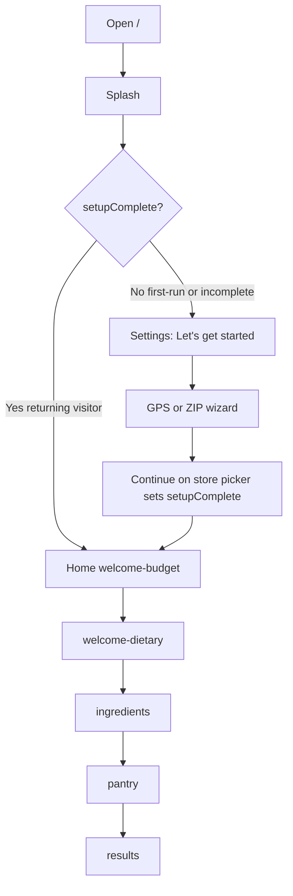
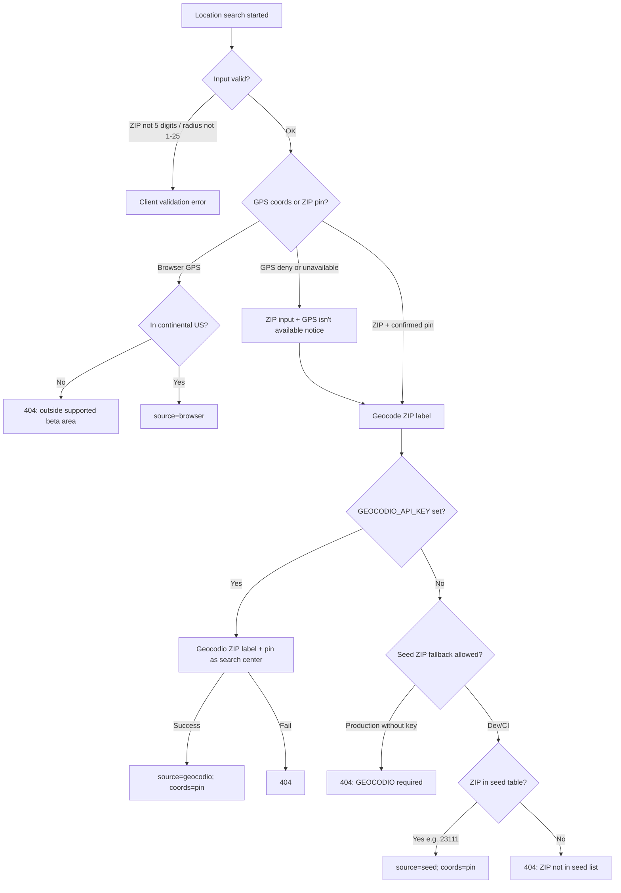
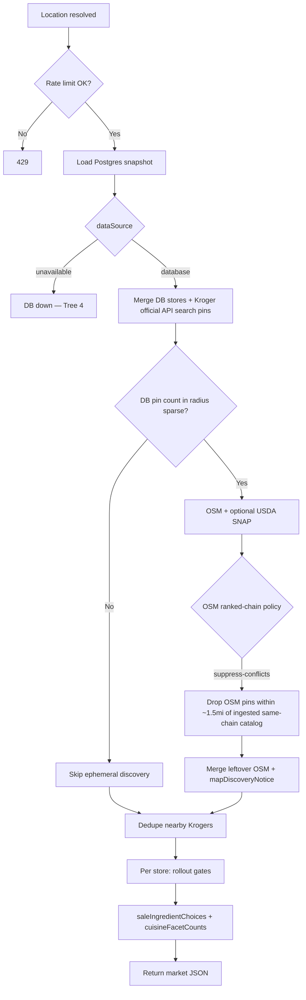
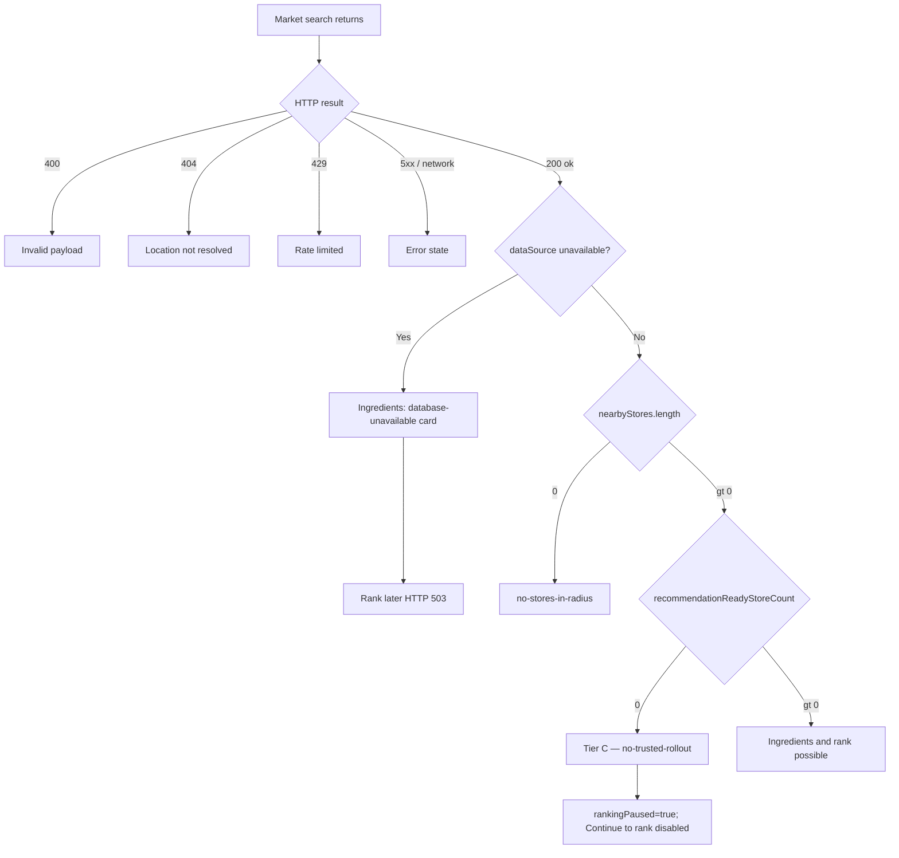
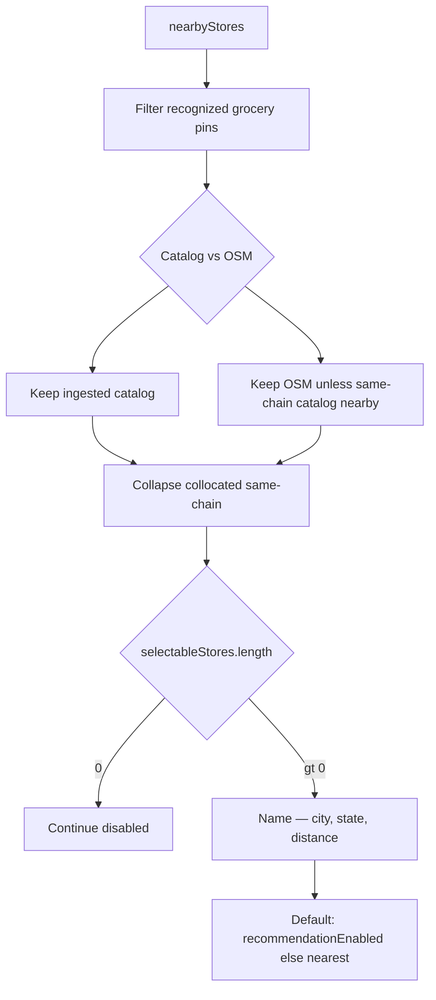
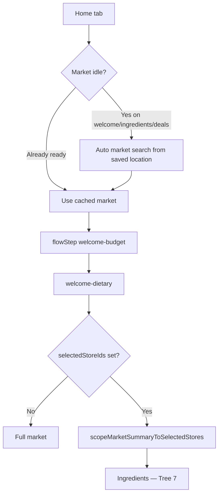
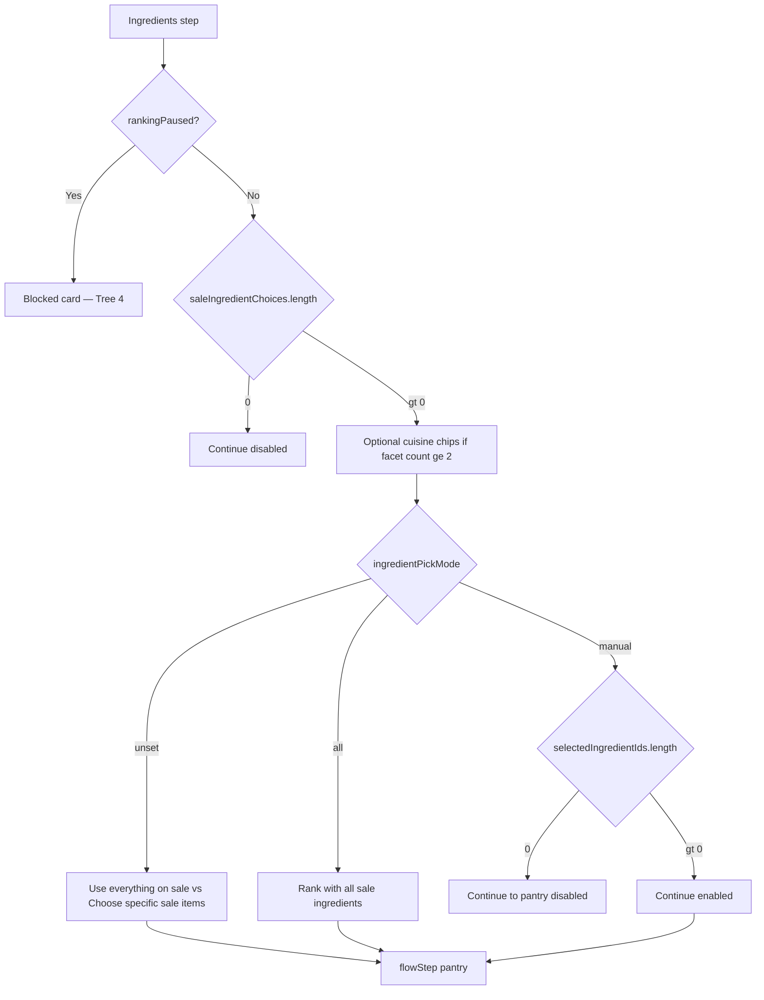
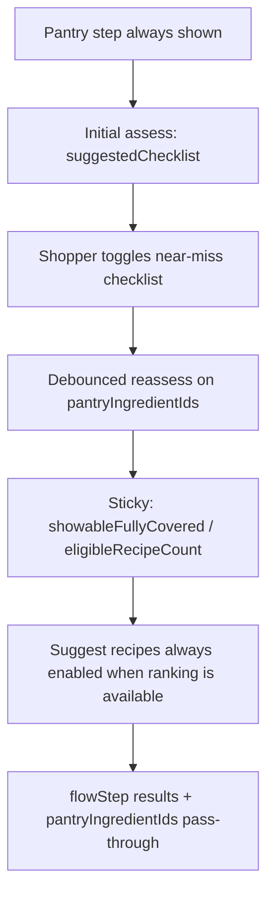
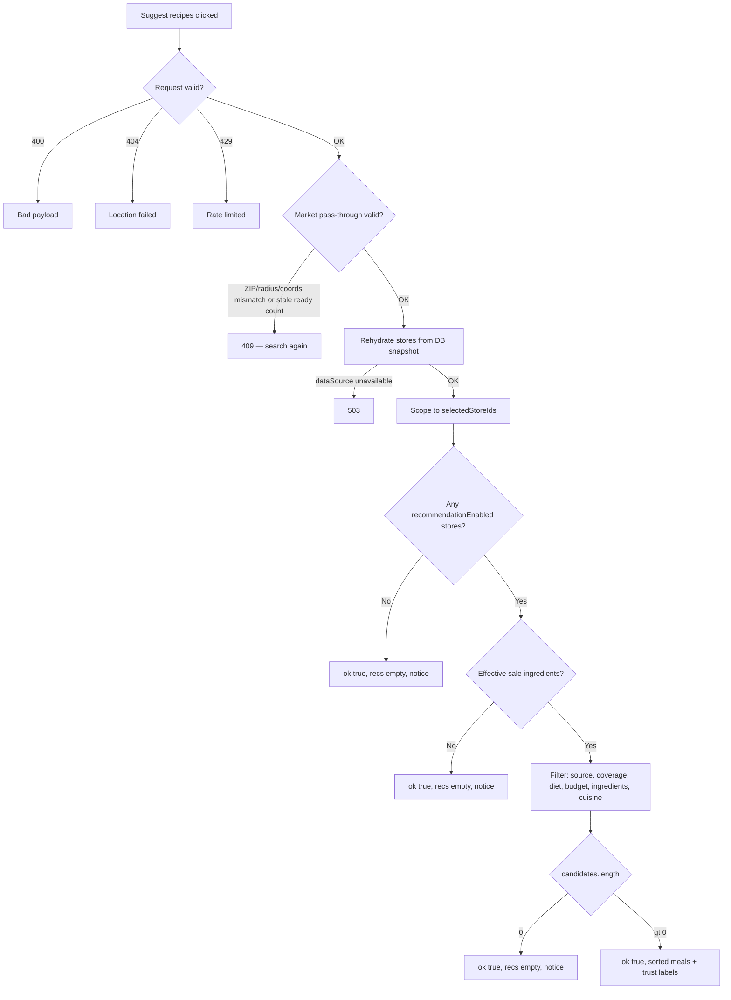
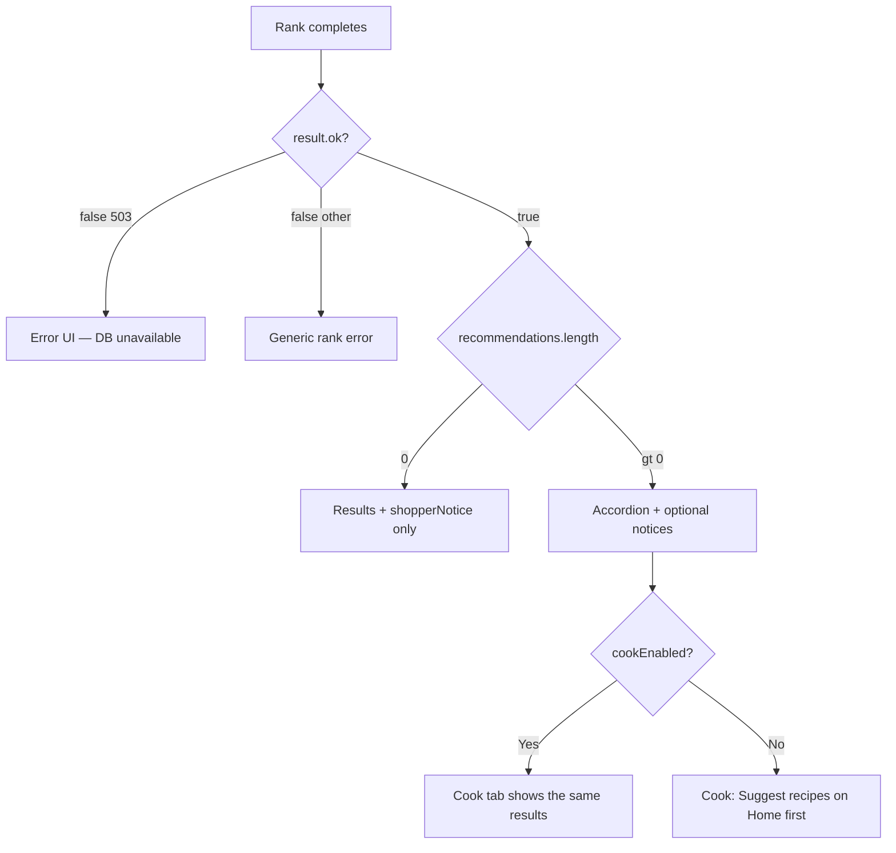

# Yum4Less shopper workflows

Living catalog of **shopper-facing** control flow. Inferred from the repo (the same code yum4less.com deploys after Watchtower). This is the only document that owns shopper trees, step tables, and “what happens next.”

**Not this file:** owner `/owner` console, ingest/cron, CI. Flyer-line classification → [`provider-integration-pattern.md`](provider-integration-pattern.md#unmatched-flyer-line-classification). Chain status tonight → [`PROJECT_CONTINUITY.md`](../PROJECT_CONTINUITY.md) Resume. How to run tests → [`e2e/README.md`](../e2e/README.md).

**Key files:** `src/components/meal-planner/onboarding-step.ts`, `flow-step.ts`, `app-tab.ts`, `use-meal-planner.ts`, `index.tsx`.

**As of 2026-09-17:** first-run is splash → GPS or ZIP+pin wizard → Home budget/dietary → ingredients → pantry → rank. Ranking is TheMealDB with a numeric full-recipe page id plus sale overlap. Cuisine chips hide until ≥2 rankable dinners match.

---

## How to read these trees

Follow arrows top to bottom. Mermaid renders on GitHub and in Cursor preview.

| Symbol | Meaning |
|--------|---------|
| Diamond | Decision / branch |
| Tier C | Map/context works; ranked meal estimates do not (normal in many ZIPs) |
| `recommendationEnabled` | Per-store flag after weekly-ad or Kroger API promotion gates **and** `chain_registry.shopper_ranked` |

---

## Tree 1 — Launch, splash, and tabs



`isSettingsPreferencesComplete()` requires `setupComplete === true` (only on explicit store-picker Continue), valid location (ZIP **or** `locationMode === geolocation`), radius, shopping style, at least one `selectedStoreId`, and exactly one store in single-store mode.

ZIP, radius, stores, and theme persist to `localStorage` (`yum4less.settings-preferences.v1`). Exact GPS coordinates are session-only. `setupComplete` stays false until the shopper finishes the store picker.

**Reset Preferences** (choose-location and store-picker) clears prefs, ZIP pin cache, saved meals, and session snapshot, then shows splash again — same as first visit.

Incomplete setup: splash → resume last persistable wizard step. Feedback and Settings stay usable; Home / Deals / Cook / Saved show a remaining-steps message.

**Key files:** `src/lib/settings-preferences.ts`, `src/components/meal-planner/app-tab.ts`, `onboarding-step.ts`

---

## Tree 2 — Location (GPS / ZIP)

Settings CTAs: **Use GPS** · **Enter ZIP code**. ZIP places a map pin (cached in `yum4less.zip-search-centers.v1`) as the radius center. GPS skips a pin map and goes to radius.



Chrome **Back** walks `previousOnboardingStep`: zip-input → choose-location; zip-pin → zip-input; radius → zip-pin (ZIP) or choose-location (GPS); shopping-style → radius; stores → shopping-style.

**Key files:** `src/lib/location-resolution.ts`, `src/lib/geocoding.ts`, `src/lib/zip-search-centers.ts`, `src/components/meal-planner/onboarding-step.ts`

---

## Tree 3 — Market search (`POST /api/market-search`)

Market search runs when leaving the **radius** screen (not on every later tap). After setup, Home/Deals can auto-search from saved location.



### Per-store dinner estimates at search time

Membership is `chain_registry.shopper_ranked` (fixture CI set: Kroger, Aldi, Publix, Food Lion, Walmart, Dollar General). Floors stay in code. Live roster can differ — see Resume.

| Chain | `recommendationEnabled: true`? | How |
|-------|--------------------------------|-----|
| Kroger-family | Yes when gates pass | Weekly-ad **or** Kroger official API promotion |
| Aldi, Publix, Food Lion, Walmart | Yes when gates pass | Weekly-ad promotion |
| Dollar General | Yes only as food-desert | Same weekly-ad floors **and** no other shopper-ranked grocer nearby |
| Lidl, Target, BJ's, unknown | **Never** for dinners | Map/context or coming-soon; Target may appear in the picker |

Weekly-ad promotion gates (per store): chain is shopper-ranked for dinners, `usesWeeklyAdSource` and `matchedIngredientCount > 0`, ≥ `MIN_WEEKLY_AD_PROMOTION_MATCHES` (3), average confidence ≥ `MIN_WEEKLY_AD_PROMOTION_CONFIDENCE` (0.45), freshness &lt; `WEEKLY_AD_PROMOTION_FRESHNESS_HOURS` (24), `coverageStatus !== "none"`.

**Key files:** `src/app/api/market-search/route.ts`, `src/lib/market-search-service.ts`, `src/lib/provider-rollout.ts`, `src/lib/chain-membership.ts`, `src/lib/dollar-general-dinner-eligibility.ts`

---

## Tree 4 — After market search (client)



Client `marketBlocked` = scoped market exists **and** `recommendationReadyStoreCount === 0`.

**Key files:** `src/lib/market-shopper-status.ts`, `src/components/meal-planner/use-meal-planner.ts`

---

## Tree 5 — Store picker

Picker is recognized grocery / club / dollar banners in radius (plus Target / Whole Foods when present) — not a four-chain TypeScript allowlist. Convenience, bakeries, pharmacies, and map fixtures are omitted. Per banner, keep catalog pins; keep live OSM unless a catalog pin is within ~1.5 mi. Dinner estimates still need `recommendationEnabled`.



**One store:** exactly one checkbox. **Several stores:** one or more. Unselected stores do not appear on the map, ingredient list, or rank.

**Key files:** `src/lib/settings-store-selection.ts`, `src/components/meal-planner/store-picker-screen.tsx`

---

## Tree 6 — Home flow



Budget and dietary are session-only (not Settings). **How do you shop?** and **Dietary focus** advance on tap (no extra Continue). Budget uses Continue.

**Key files:** `src/components/meal-planner/index.tsx`, `use-meal-planner.ts`, `src/lib/store-scope.ts`

---

## Tree 7 — Ingredients



Optional map link: **Do you want to see store locations?** → overlay scoped to selected stores.

**Key files:** `src/components/meal-planner/ingredients-step-panel.tsx`, `ingredient-gate-panel.tsx`, `cuisine-chip-toolbar.tsx`

---

## Tree 7b — Pantry (`POST /api/pantry-coverage`)



| Rule | Behavior |
|------|----------|
| Near-miss checklist | Distinct missing ingredients from recipes missing 1–4 plan lines (empty OK) |
| Checklist membership | Stays when checked; later coverage does not remove rows |
| Sticky count | Fully covered **and** would survive ranking gates (budget, plan, `maxIngredients`) |
| Totals | Pantry lines excluded from `estimatedTotal` |
| Session | `pantryIngredientIds` not persisted |

**Key files:** `src/components/meal-planner/pantry-step-panel.tsx`, `src/app/api/pantry-coverage/route.ts`

---

## Tree 8 — Rank (`POST /api/recommendations`)



| HTTP / response | Meaning |
|-----------------|--------|
| **503** | Infrastructure / DB unavailable |
| **409** | Stale market snapshot — re-run setup location search |
| **ok:true + empty + notice** | Honest empty rank (coverage, filters, Tier C) |

**Key files:** `src/app/api/recommendations/route.ts`, `src/lib/recommendation-service.ts`, `src/lib/market-pass-through.ts`

---

## Tree 9 — Per-meal candidate filters

A recipe is ranked only if **all** pass:

1. Ranking pool: TheMealDB with a numeric full-recipe page id (short internal writeups excluded)
2. Sale-priced ingredients overlap the recipe
3. Matches manual `selectedIngredientIds` when pick mode is manual
4. Matches dietary focus (vegetarian / vegan / quick)
5. Matches selected cuisine chips when any are on
6. `estimatedTotal ≤ budget`
7. Shopping-plan ingredient count ≤ `maxIngredients`
8. Single-store or multi-store plan builds
9. `scoreCandidate` returns a valid plan

All drop → empty results with shopper notice.

**Key files:** `src/lib/recommendation-service.ts`, `src/lib/shopping-plan-builder.ts`, `src/lib/cuisine-chips.ts`

---

## Tree 10 — Results, Cook, other tabs



**C1:** `shopperNotice` and non-empty `recommendations` may both render.

| Tab | After setup | Notes |
|-----|-------------|-------|
| Home | Dinner flow | Budget → dietary → ingredients → pantry → results |
| Deals | Browse sale items | Same scoped market |
| Cook | Unlocked after ≥1 ranked meal | Same accordion as Home results |
| Saved | Device-local saved meals | Not cross-device (no accounts) |
| Feedback | Always | Works during setup |
| Settings | Wizard screens reused | Theme is chrome moon/sun, not a wizard step |

FAQ (`/faq`, `/faq/[slug]`) and `/terms`: circle `?` and legal links. Client Back restores last tab and theme; full reload still splash → budget.

**Key files:** `src/components/meal-planner/meal-results-panel.tsx`, `bottom-nav.tsx`

---

## Tree 11 — “Why don’t I see my grocery store?”

```
Is the pin a recognized grocery / club / dollar banner in radius after Find?
├─ NO  → Expected. Convenience, bakery, pharmacy, and most independents are omitted.
└─ YES → In picker after catalog vs OSM dedupe?
    ├─ NO  → Widen radius, move ZIP pin, or wait for ingest / OSM gap-fill.
    └─ YES → Dinner totals on that pin?
        ├─ NO  → Map/context (Lidl, Target, BJ's, or floors not passed / DG with other grocers nearby).
        └─ YES → `recommendationEnabled` after membership + weekly-ad (or Kroger API) gates.
```

---

## Tree 12 — Symptom → cause → action

| What you see | Likely branch | What to try |
|--------------|---------------|-------------|
| Stuck on splash / Let’s get started | `setupComplete` false | Finish GPS or ZIP wizard through store picker Continue |
| “Enter a valid 5-digit ZIP code.” | Location validation | 5-digit continental US ZIP |
| Location 404 | Seed / Geocodio miss | `GEOCODIO_API_KEY`, seed ZIP (23111) in dev, or GPS |
| GPS isn't available | Permission denied | Continue on ZIP + pin |
| Store picker empty | No recognized grocery pins in radius | Larger radius, move pin, ingest |
| Map has a pin, picker doesn’t | Not a grocery banner, or OSM suppressed as duplicate | Pick a supermarket/club/dollar pin |
| “Map ready — meal estimates not available” | Tier C | Ingest refresh; read map labels |
| “Store and meal prices aren't loading” | `dataSource === "unavailable"` | `npm run db:up`, fixture ingest |
| No sale ingredients | Empty `saleIngredientChoices` | Different store, ingest |
| Continue to pantry greyed out | `rankingPaused` or manual pick with zero items | Fix Tier C or check a sale item |
| Cuisine toolbar missing | Fewer than 2 rankable dinners for that cuisine | Expected hide-empty |
| Rank 409 | Stale market pass-through | Re-run location search in Settings |
| Rank 503 | DB unavailable at rank time | Fix Postgres |
| Rank ok, 0 meals | Filter / coverage | Budget, ingredients, dietary, cuisine |
| Cook tab message | `cookEnabled` false | Successful rank with ≥1 meal |
| Splash then budget every visit | Returning visitor by design | Brief splash, then Home |

---

## End-to-end paths (summary)

### Happy path

Wizard complete → `dataSource=database` + `recommendationReadyStoreCount > 0` → sale ingredients → pantry → rank returns meals → Cook unlocks.

### Normal beta path (Tier C)

Wizard complete → stores on map → **no store passes promotion gates** → ingredients blocked → map/context still useful.

### Broken dev path

Postgres down → market empty or blocked → rank **503** → fix DB + ingest before product debugging.

---

## Technical pipeline

```
Browser (useMealPlanner)
  ├─ localStorage — yum4less.settings-preferences.v1
  ├─ sessionStorage — home snapshot / splashFinished
  ├─ POST /api/market-search
  │     ├─ resolveLocationInput
  │     └─ getMarketSearchExperience → Postgres + provider + optional OSM
  ├─ POST /api/pantry-coverage
  └─ POST /api/recommendations
        ├─ validatePassedMarketForRanking (409 if stale)
        └─ getRecommendationExperience → scope stores → filter recipes → score
```

Public HTTP routes are read-only by default (`YUM4LESS_ENABLE_API_DB_WRITES` required for API writes).

---

## Playwright coverage (representative branches)

This is not every combination. Spec file map and commands stay in [`e2e/README.md`](../e2e/README.md).

| Branch | Spec |
|--------|------|
| ZIP happy path, accordion, splash, save-to-Saved | `mvp-flow.spec.ts` |
| GPS primary | `coordinate-first.spec.ts` |
| GPS deny → ZIP | `gps-deny.spec.ts` |
| Wizard Back, Reset Preferences, manual ingredients, cuisine chips | `shopper-workflow-branches.spec.ts` |
| Locked tabs, Cook gate, theme | `navigation-theme.spec.ts` |
| Pantry checklist | `pantry-step.spec.ts` |
| Tier C (mocked) | `tier-c.spec.ts` |
| API 400/500 copy | `api-errors.spec.ts` |
| FAQ / terms round-trip | `faq-terms.spec.ts` |
| Store picker / ZIP validation | `settings-stores.spec.ts` |
| Map overlay | `single-store-map-overlay.spec.ts` |
| Stale store IDs | `stale-store-selection.spec.ts` |
| Market pass-through | `market-pass-through.spec.ts` |

Update this file when shopper flow or gating logic changes materially.
